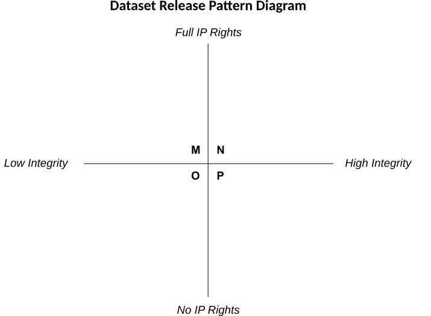
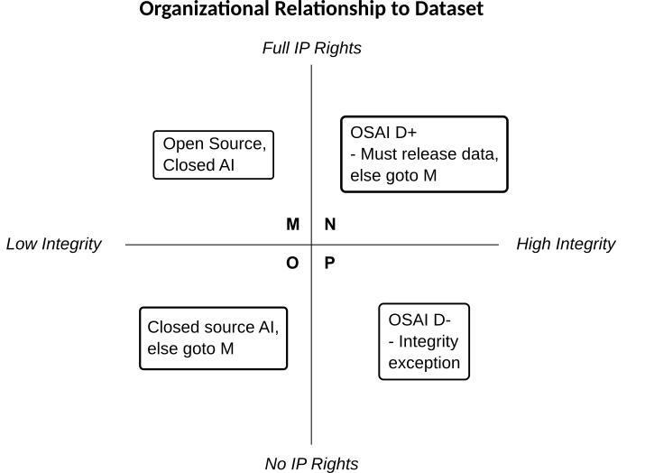

# Proposal to handle Data Openness in the Open Source AI definition [RFC]

Friends,

As I’ve been researching many different efforts that claim various levels of Open Source AI, I’ve noticed a pattern around the types of training dataset used for a model.
This pattern has led me to a possible solution to the debates around the Open Source AI definition’s commitment to requiring Open Data.

Summary — This proposal is for an exception in the OSAI definition to not provide some or all of a training dataset under specific conditions:  when the dataset cannot reasonably be released for reasons outside of the model creator’s control and the model creators are otherwise acting with integrity in sourcing the data and toward Opening everything else, the release can claim/receive the “OSAI D-” designation to indicate the exception.

(I’m aware the actual terms for this would exist in licenses designed to be compliant to the OSAID.
For introducing this idea I am choosing a method of a D- designator that is grounded in the definition; these approaches can be improved, natch.)

So far the discussion around this binary condition (with or without data) has also been binary.
My intention here is to introduce an appropriate amount of nuance to show there seem to be five states rather than two — with one state existing in two quadrants because IP rights and provenance are obscured when kept closed (the Schroedinger’s cat of IP rights.)

To start I’ll define the pattern I’ve observed, then diagram the pattern, and finally integrate the proposed solution into the diagram.
The four quadrants in the diagram are M, N, O, and P, which are redefined below after the integration diagram.
 
This is the core of the observed pattern:

1. For every potentially OSAI-compliant model, the training dataset either is released or is not released.
   1. Is Released [N] — those who release the training dataset intend to act with integrity to the existing Open Source definition (OSD), as well as having the rights to license the data. 
   1. Is Not Released — those who do not release the training dataset fall into one of two groups:
      1. No IP Rights [P] — they would release the dataset if they could, but they do not have the rights to release the data in one or more jurisdictions.
They claim or appear to be acting with high integrity to overriding conditions or law, rather than selfishness.
      1. Have IP Rights Without Integrity [M] — they have the rights to release the dataset but do not choose to do so, most likely for one of these reasons:
      	 1. Commercial or research competition.
	 1. They cannot prove the provenance of the dataset to be sure they have the rights to release it.
	    1. Variant — they know/believe the provenance may not/does not give them the rights to release the dataset, and they wish to mitigate that risk through obscurity.
1. Non-OSAI models and systems are low integrity to the Open ecosystem overall, with two variants to fit into quadrants:
   1. No or Unclear IP Rights — [O] quadrant for fully-closed.
   1. Full IP Rights — [M] quadrant, choosing not to Openly license the software.

Here is the base diagram of for these quadrant definitions:

Here is the diagram with the proposed D-/D+ solution mapped to the quadrants:

The diagram restated means:

The “M” quadrant is where the model creators have the rights to license the software and full training data, but choose not to do so.
They may call properly licensed software OSD compliant, but their AI is closed and cannot be referred to as “Open Source AI”.

The “N” quadrant is where the model creators have the rights and integrity to release the full training data et al. With a proper license, they are OSAI D+ compliant.

The “O” quadrant is where the model creators have no rights or choose not to license the software or data, and this is the realm of all closed source AI.

The “P” quadrant is where the model creators would release the data if they had the rights to it, but for legitimate reasons cannot release the data.
If they are acting with high integrity toward the spirit and meaning of Open, and also properly license all assets except the training dataset, they are OSAI D- compliant. 

----

This proposal and the diagrams in editable SVG format are in this repo:
https://github.com/quaid/OSAID-WIP/tree/main/dataset_proposal